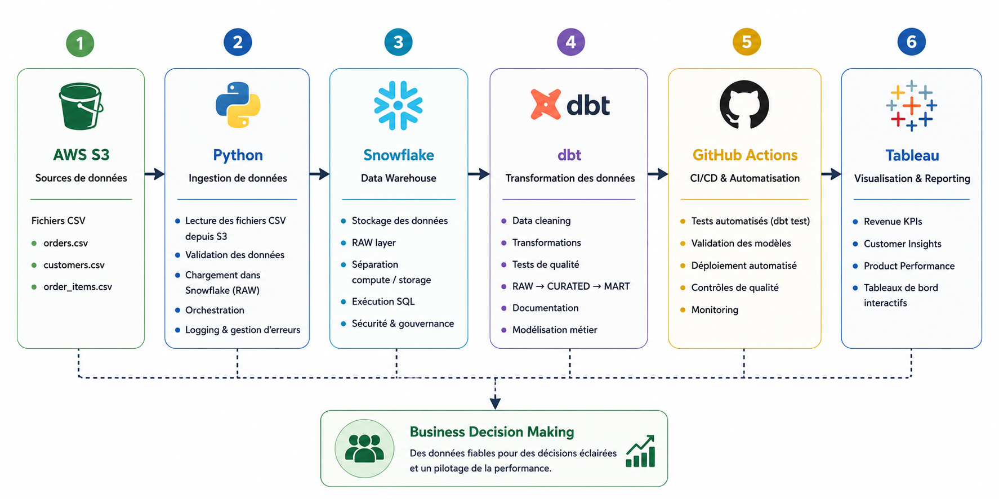
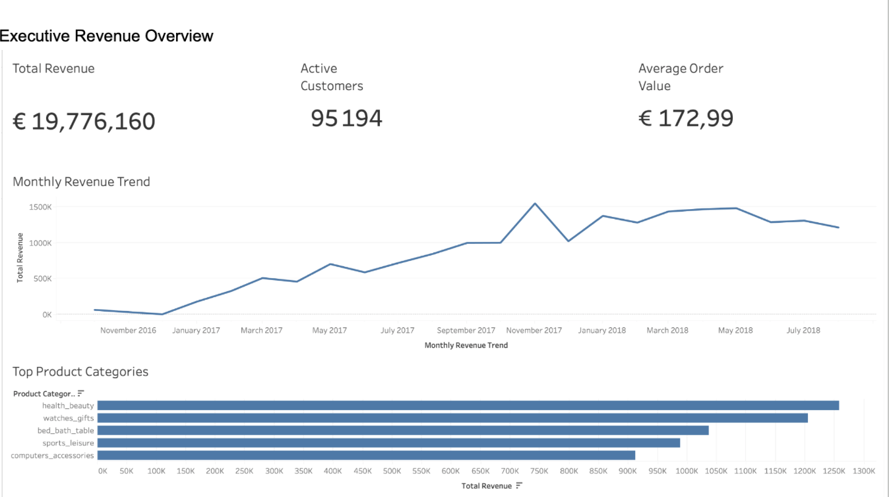
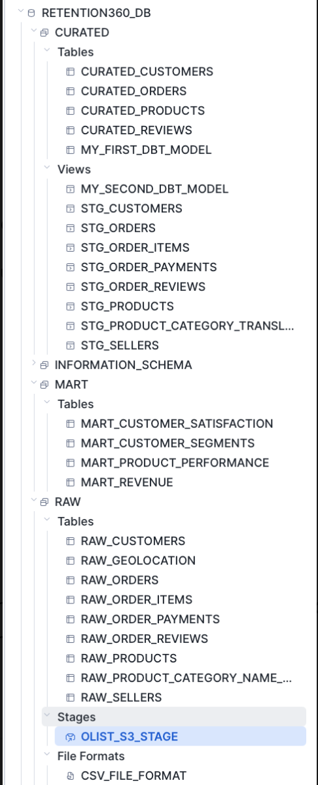

# Retention360 Data Platform

## 1. Business Problem

Build an end-to-end data platform that ingests, transforms and models e-commerce data into trusted business datasets through a modern data architecture (AWS S3 → Snowflake → dbt → Tableau).

The objective is to simulate a production-inspired data environment and deliver reliable data for analytics and business decision-making.

---

## 2. Architecture

  

---

## 3. Data Pipeline

### 1. Data Ingestion — Python → AWS S3

**Objective:**  
Collect and load raw source data into cloud storage.

**Actions:**
- Downloaded raw CSV files from the Olist dataset
- Implemented ingestion scripts in Python
- Uploaded datasets into an AWS S3 bucket
- Organized data following a RAW layer structure

**Technologies:**  
`Python · Pandas · AWS S3`

---

### 2. Data Warehouse Loading — AWS S3 → Snowflake RAW

**Objective:**  
Centralize raw data inside the data warehouse.

**Actions:**
- Created Snowflake database and schemas
- Configured Snowflake stages
- Loaded files into RAW tables
- Preserved original source structure

**Technologies:**  
`Snowflake · SQL · COPY INTO`

---

### 3. Data Transformation — dbt (RAW → CURATED → MART)

**Objective:**  
Transform raw data into trusted and business-ready datasets.

**Actions:**
- Built staging models
- Standardized formats and timestamps
- Applied business transformation rules
- Created analytical MART tables

**Data Layers:**
- RAW
- CURATED
- MART

**Technologies:**  
`dbt · SQL · Snowflake`

---

### 4. Data Quality & Validation

**Objective:**  
Ensure data reliability and consistency.

**Actions:**
- Implemented null checks
- Applied uniqueness validation
- Performed type conversions
- Enforced business validation rules
- Executed automated dbt tests

**Technologies:**  
`dbt test`

---

### 5. Analytics & Dashboard Delivery

**Objective:**  
Deliver business insights through interactive dashboards.

**Actions:**
- Exported MART datasets
- Connected Tableau Public
- Built executive dashboards
- Added interactive filtering

**KPIs:**
- Revenue
- Active Customers
- Average Order Value
- Product Performance

**Technologies:**  
`Tableau Public`

---

## 4. Pipeline Overview

  

---

## 5. Data Warehouse Implementation

This project uses Snowflake as the central data warehouse following a medallion architecture.

### Structure

  

### Data Layers

- **RAW** → Stores original source data loaded from AWS S3
- **CURATED** → Cleansed and transformed business datasets
- **MART** → Analytics-ready datasets optimized for reporting